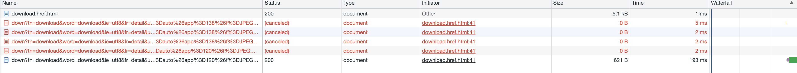
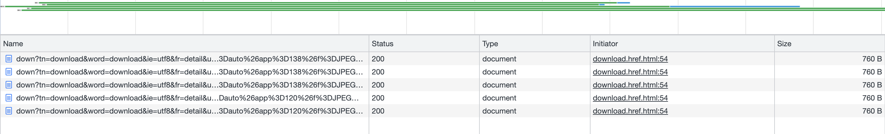
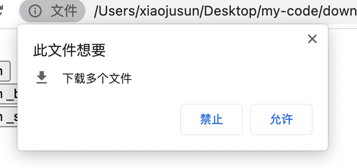

### 背景
项目中，客户有个需求，需要在查询日期中的文件，由于文件可能会有多个，所需要多处理一下多文件同时下载的情况，

### 思考
首先多文件下载的话，使用循环同时触发下载多个文件,首先想到常用的几种方式，然后通过循环调用，确认是否可以正常下载

常用的自动触发下载的集中方式
- window.open()  直接下载
- 创建a标签下载 
- 创建iframe下载 

#### 首先使用window.open尝试
window.open(url, type)支持两个参数，
- url: 下载文件的目标路径，
- type: 支持两种类型：
  - _blank: 新开发一个窗口下载，下载的时候新窗口会关闭，界面会闪一下
  - _self: 直接在当前窗口下载

```js
  [url,url1,url2,url3,url4].forEach((url) => {
    window.open(url, '_self');
  });
```
这种方式下载，会被认为恶意操作，只会下载最后一个请求


<!-- more -->

#### 通过a标签下载   ---- 查资料说跨域文件批量下载，多个文件被cancel下载（待考证）

```js
  [downloadUrl,downloadUrl1,downloadUrl2,downloadUrl3,downloadUrl4].forEach((url) => {
    const a = document.createElement('a');
    a.href = url;
    a.click();
    a.remove();
  });
```



#### 通过iframe 创建下载标签 也可以正常下载

```js
 [downloadUrl,downloadUrl1,downloadUrl2,downloadUrl3,downloadUrl4].forEach((url) => {
  const iframe = document.createElement('iframe');
  iframe.style.display = 'none';
  iframe.style.height = 0;
  iframe.src = url;
  // 与前两种方式不同，iframe需要挂载到页面上才能触发请求
  document.body.appendChild(iframe);
  setTimeout(() => {
    iframe.remove();
  }, 1000);
  });
```


注意： 
- Transfer-Encoding: chunked  文件过大的话，可以通过response header中设置这个参数设置分片下载
- 批量下载的话，浏览器会出现这个提示，需要允许浏览器可以批量下载文件，否则只会下载第一个文件



### 实现附件下载
在服务端下载的场景中，附件形式下载是一种比较常见的场景。在该场景下，我们通过设置 Content-Disposition 响应头来指示响应的内容以何种形式展示，是以内联（inline）的形式，还是以附件（attachment）的形式下载并保存到本地。
```js
Content-Disposition: inline
Content-Disposition: attachment
Content-Disposition: attachment; filename="mouth.png"
```
而在 HTTP 表单的场景下， Content-Disposition 也可以作为 multipart body 中的消息头：
```js
Content-Disposition: form-data
Content-Disposition: form-data; name="fieldName"
Content-Disposition: form-data; name="fieldName"; filename="filename.jpg"
```