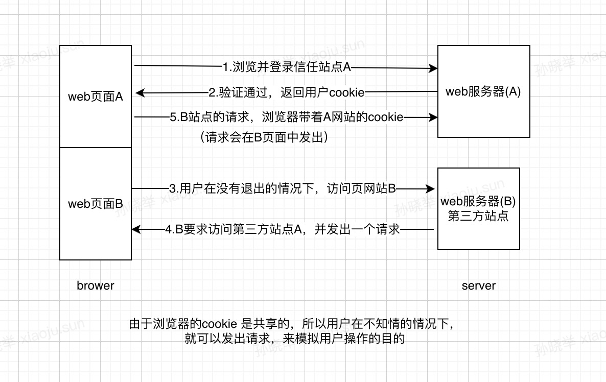

### 什么是CSRF？
CSRF全称：Cross—Site Request Forgery，中文名称：跨站请求伪造有，也被成为XRCF
一般来说，攻击者通过伪造用户的浏览器的请求，向访问一个用户自己曾经认证访问过的网站发送出去，使目标网站接收并误以为是用户的真实操作而去执行命令。常用于盗取账号、转账、发送虚假消息等。攻击者利用网站对请求的验证漏洞而实现这样的攻击行为，网站能够确认请求来源于用户的浏览器，却不能验证请求是否源于用户的真实意愿下的操作行为。

### 攻击原理和过程

1. 用户打开浏览器，访问受信任网站A，输入用户名和密码请求登录网站A；
2. 在用户信息通过验证后，网站A产生Cookie信息并返回给浏览器，此时用户登录网站A成功，可以正常发送请求到网站A；
3. 用户未退出网站A之前，在同一浏览器中，打开一个TAB页访问网站B；
4. 网站B接收到用户请求后，返回一些攻击性代码，并发出一个请求要求访问第三方站点A；
5. 浏览器在接收到这些攻击性代码后，根据网站B的请求，在用户不知情的情况下携带Cookie信息，向网站A发出请求。网站A并不知道该请求其实是由B发起的，所以会根据用户C的Cookie信息以C的权限处理该请求，导致来自网站B的恶意代码被执行。

<!-- more -->

### CSRF 漏洞检测

- 抓取正常的请求数据包，去掉referer字段之后，看提交请求是否仍然有效;
- 也可以使用一些工具进行检测如：CSRFTester，CSRF Request Builder等。

### CSRF的防御

- 验证请求http中的referer
根据 HTTP 协议，在 HTTP 头中有一个字段叫 Referer，它记录了该 HTTP 请求的来源地址。
在通常情况下，访问一个安全受限页面的请求来自于同一个网站，比如需要访问 http://bank.example/withdraw?account=bob&amount=1000000&for=Mallory，用户必须先登陆 bank.example，然后通过点击页面上的按钮来触发转账事件。这时，该转帐请求的 Referer 值就会是转账按钮所在的页面的 URL，通常是以 bank.example 域名开头的地址。而如果黑客要对银行网站实施 CSRF 攻击，他只能在他自己的网站构造请求，当用户通过黑客的网站发送请求到银行时，该请求的 Referer 是指向黑客自己的网站。因此，要防御 CSRF 攻击，银行网站只需要对于每一个转账请求验证其 Referer 值，如果是以 bank.example 开头的域名，则说明该请求是来自银行网站自己的请求，是合法的。如果 Referer 是其他网站的话，则有可能是黑客的 CSRF 攻击，拒绝该请求。
这种方法的显而易见的好处就是简单易行，网站的普通开发人员不需要操心 CSRF 的漏洞，只需要在最后给所有安全敏感的请求统一增加一个拦截器来检查 Referer 的值就可以。特别是对于当前现有的系统，不需要改变当前系统的任何已有代码和逻辑，没有风险，非常便捷。
然而，这种方法并非万无一失。Referer 的值是由浏览器提供的，虽然 HTTP 协议上有明确的要求，但是每个浏览器对于 Referer 的具体实现可能有差别，并不能保证浏览器自身没有安全漏洞。使用验证 Referer 值的方法，就是把安全性都依赖于第三方（即浏览器）来保障，从理论上来讲，这样并不安全。
事实上，目前已经有一些方法可以篡改 Referer 值，即便是使用最新的浏览器，黑客无法篡改 Referer 值，这种方法仍然有问题。因为 Referer 值会记录下用户的访问来源，有些用户认为这样会侵犯到他们自己的隐私权，特别是有些组织担心 Referer 值会把组织内网中的某些信息泄露到外网中。因此，用户自己可以设置浏览器使其在发送请求时不再提供 Referer。当他们正常访问银行网站时，网站会因为请求没有 Referer 值而认为是 CSRF 攻击，拒绝合法用户的访问。

- 请求中增加token

CSRF 攻击之所以能够成功，是因为黑客可以完全伪造用户的请求，该请求中所有的用户验证信息都是存在于 cookie 中，因此黑客可以在不知道这些验证信息的情况下直接利用用户自己的 cookie 来通过安全验证。要抵御 CSRF，关键在于在请求中放入黑客所不能伪造的信息，并且该信息不存在于 cookie 之中。可以在 HTTP 请求中以参数的形式加入一个随机产生的 token，并在服务器端建立一个拦截器来验证这个 token，如果请求中没有 token 或者 token 内容不正确，则认为可能是 CSRF 攻击而拒绝该请求。
这种方法要比检查 Referer 要安全一些，token 可以在用户登陆后产生并放于 session 之中，然后在每次请求时把 token 从 session 中拿出，与请求中的 token 进行比对，但这种方法的难点在于如何把 token 以参数的形式加入请求。对于 GET 请求，token 将附在请求地址之后，这样 URL 就变成 http://url?csrftoken=tokenvalue。 而对于 POST 请求来说，要在 form 的最后加上 <input type=”hidden” name=”csrftoken” value=”tokenvalue”/>，这样就把 token 以参数的形式加入请求了。但是，在一个网站中，可以接受请求的地方非常多，要对于每一个请求都加上 token 是很麻烦的，并且很容易漏掉，通常使用的方法就是在每次页面加载时，使用 javascript 遍历整个 dom 树，对于 dom 中所有的 a 和 form 标签后加入 token。这样可以解决大部分的请求，但是对于在页面加载之后动态生成的 html 代码，这种方法就没有作用，还需要程序员在编码时手动添加 token。
该方法还有一个缺点是难以保证 token 本身的安全。特别是在一些论坛之类支持用户自己发表内容的网站，黑客可以在上面发布自己个人网站的地址。由于系统也会在这个地址后面加上 token，黑客可以在自己的网站上得到这个 token，并马上就可以发动 CSRF 攻击。为了避免这一点，系统可以在添加 token 的时候增加一个判断，如果这个链接是链到自己本站的，就在后面添加 token，如果是通向外网则不加。不过，即使这个 csrftoken 不以参数的形式附加在请求之中，黑客的网站也同样可以通过 Referer 来得到这个 token 值以发动 CSRF 攻击。这也是一些用户喜欢手动关闭浏览器 Referer 功能的原因。

- HTTP请求头中自定义属性，并进行验证

这种方法也是使用 token 并进行验证，和上一种方法不同的是，这里并不是把 token 以参数的形式置于 HTTP 请求之中，而是把它放到 HTTP 头中自定义的属性里。通过 XMLHttpRequest 这个类，可以一次性给所有该类请求加上 csrftoken 这个 HTTP 头属性，并把 token 值放入其中。这样解决了上种方法在请求中加入 token 的不便，同时，通过 XMLHttpRequest 请求的地址不会被记录到浏览器的地址栏，也不用担心 token 会透过 Referer 泄露到其他网站中去。
然而这种方法的局限性非常大。XMLHttpRequest 请求通常用于 Ajax 方法中对于页面局部的异步刷新，并非所有的请求都适合用这个类来发起，而且通过该类请求得到的页面不能被浏览器所记录下，从而进行前进，后退，刷新，收藏等操作，给用户带来不便。另外，对于没有进行 CSRF 防护的遗留系统来说，要采用这种方法来进行防护，要把所有请求都改为 XMLHttpRequest 请求，这样几乎是要重写整个网站，这代价无疑是不能接受的。

原文链接：https://blog.csdn.net/weixin_40482816/article/details/114301717