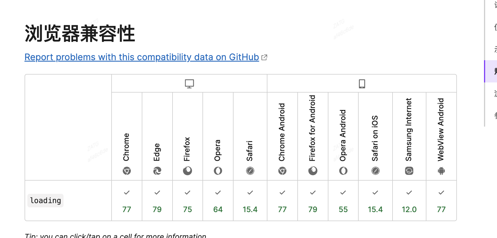

## 图片懒加载的两种种实现方式
在web开发中，通常需要考虑一些性能方面的优化，这里记录一下常见的优化点之一 ---- 图片懒加载

那么什么是懒加载呢？
```js
懒加载是延迟加载一些资源（如：图片）的一种策略，以用户的行为和导航模式为依据，判断图片在被需要的时候才加载。通常来说，仅当这些资源滚动到视图中才被加载?
```

### lazy ----- 采用浏览器提供的的支持方式

新版浏览器中已经支持image/iframe的懒加载，仅需在img/iframe元素中添加 loading="lazy"属性，
```js

<iframe src="iframe" loading="lazy"></iframe>
```

浏览器支持版本：


#### 关键点： 必须要给img设置width和height属性
- 懒加载的原理是利用图片的高度和时区的高度来进行计算的，如果图片没有设置高度，那么就是0，无论放多少图片， 都是为在可视区域的范围之内，会立马进行加载
- 默认加载差不多2页左右的图片数据，当然这个跟图片所在的容器有关系，而不是跟浏览器有关系


### 其他问题
1. loading="eager"跟loading="lazy"相反，意思是不懒加载，直接加载，一般用不上
2. 如何判断浏览器是否支持懒加载呢？
  ```js
  //true 为支持
  const isSupportLoading = 'loading' in HTMLImageElement.prototype;
  ```


优点： 直接添加属性就行
缺点： 老版本的浏览器不支持

###  通过代码监听滚动方式实现

代码示例一： 滚动事件+函数节流  
```js
  // 
  let imgs = document.getElementsByTagName('img')
  // 1. 一上来立即执行一次
  fn()
  // 2. 监听滚动事件
  window.onscroll = lazyload(fn, true)
  function fn() {
      // 获取视口高度和内容的偏移量
      let clietH = window.innerHeight || document.documentElement.clientHeight || document.body.clientHeight;
      var scrollTop = window.pageYOffset || document.documentElement.scrollTop || document.body.scrollTop;
      console.log(clietH, scrollTop);
      for (let i = 0; i < imgs.length; i++) {
          let x = scrollTop + clietH - imgs[i].offsetTop //当内容的偏移量+视口高度>图片距离内容顶部的偏移量时，说明图片在视口内
          if (x > 0) {
              imgs[i].src = imgs[i].getAttribute('data-url'); //从dataurl中取出真实的图片地址赋值给url
          }
      }
  }
    // 函数节流
  function lazyload(fn, immediate) {
      let timer = null
      return function () {
          let context = this;
          if (!timer) {
              timer = setTimeout(() => {
                  fn.apply(this)
                  timer = null
              }, 200)
          }
      }
  }

```

代码示例三： 滚动监听+getBoundingClientRect()

语法参考： 
https://developer.mozilla.org/zh-CN/docs/Web/API/Element/getBoundingClientRect

```js
  // 

let imgs = document.getElementsByTagName('img')
  // 1. 一上来立即执行一次
  fn()
  // 2. 监听滚动事件
  window.onscroll = lazyload(fn, true)
  function fn() {
      // 获取视口高度和内容的偏移量
      let offsetHeight = window.innerHeight || document.documentElement.clientHeight
      Array.from(imgs).forEach((item, index) => {
          let oBounding = item.getBoundingClientRect() //返回一个矩形对象，包含上下左右的偏移值
          // console.log(index, oBounding.top, offsetHeight);
            // 当前图片的top值大于0，top值小于可视高度，证明进入了可视区域内
          if (0 <= oBounding.top && oBounding.top <= offsetHeight) {
              item.setAttribute('src', item.getAttribute('data-url'))
          }
      })
  }
  // 函数节流
  function lazyload(fn, immediate) {
      let timer = null
      return function () {
          let context = this;
          if (!timer) {
              timer = setTimeout(() => {
                  fn.apply(this)
                  timer = null
              }, 200)
          }
      }
  }
```

代码示例三： intersectionObserve  -- 通过进入可视区域进行判断


```js
  // 获取到所有的图片
  let imgs = document.getElementsByTagName('img')
  // 1. 一上来立即执行一次
  let io = new IntersectionObserver(function (entires) {
      //图片进入视口时就执行回调
      entires.forEach(item => {
          // 获取目标元素
          let oImg = item.target
          // 当图片进入视口的时候，就赋值图片的真实地址
          if (item.intersectionRatio > 0 && item.intersectionRatio <= 1) {
              oImg.setAttribute('src', oImg.getAttribute('data-url'))
          }
      })
  })
  Array.from(imgs).forEach(element => {
      io.observe(element)  //给每一个图片设置监听
  });

```